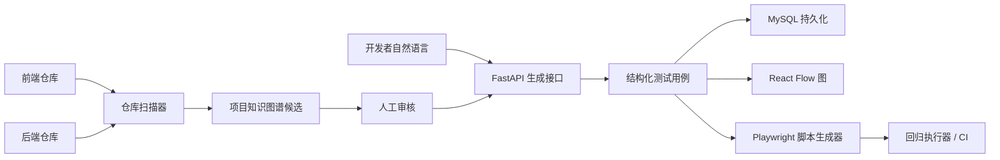

# 架构

## 产品形态

Beautiful E2E 有四个协作层：

1. 仓库智能读取前后端代码，提取路由、选择器、接口处理函数、页面名称和领域词。
2. 用例生成把自然语言转换为结构化测试用例，包含步骤、断言、标签和图节点。
3. 协作层把用例、分组、评论、审计事件和运行历史存入 MySQL。
4. 执行层导出 Playwright 脚本，并在本地开发、CI 或后续工作队列中运行。

## 数据流

## 项目知识图谱

项目分析不再只沉淀扁平接口列表。扫描器会先从控制器、路由契约、DTO、响应字段
和源码位置提取证据，再生成 `project_knowledge_graphs` 候选图谱：

- 模块：归纳接口所属模块、入口候选、适用场景、排除场景和证据来源。
- 关系：归纳接口之间的变量流，例如上游分页或搜索接口产出业务 ID，下游详情、
  首页或提交接口消费该 ID。
- 审核：候选图谱默认是 `draft`，只能作为候选证据；人工批准为 `reviewed` 后，
  `project_context.knowledge_graph` 才会作为生成 DSL 的强事实。

前端“项目分析中心”提供模块树、链路图和证据卡片。当前版本支持重建候选图谱和
批准整张图谱，后续可继续扩展模块改名、接口移动、入口标记和关系编辑。

## 用例模型

每个用例会保存为：

- 元数据：标题、分组、优先级、来源提示词、作者、状态。
- 步骤：有序的用户动作和断言。
- 图结构：用于可视化和审阅的节点与边。
- 代码上下文：仓库路径和相关文件。
- 导出产物：可选的 Playwright 脚本路径。

## 协作模型

第一个版本刻意保持协作模型简单：

- 用户可以编写用例和评论。
- 审计事件追踪生成、编辑和导出。
- 运行记录把用例或分组连接到执行结果。

后续可以引入团队、单点登录、基于角色的访问控制、审批状态，以及感知分支的用例版本。
